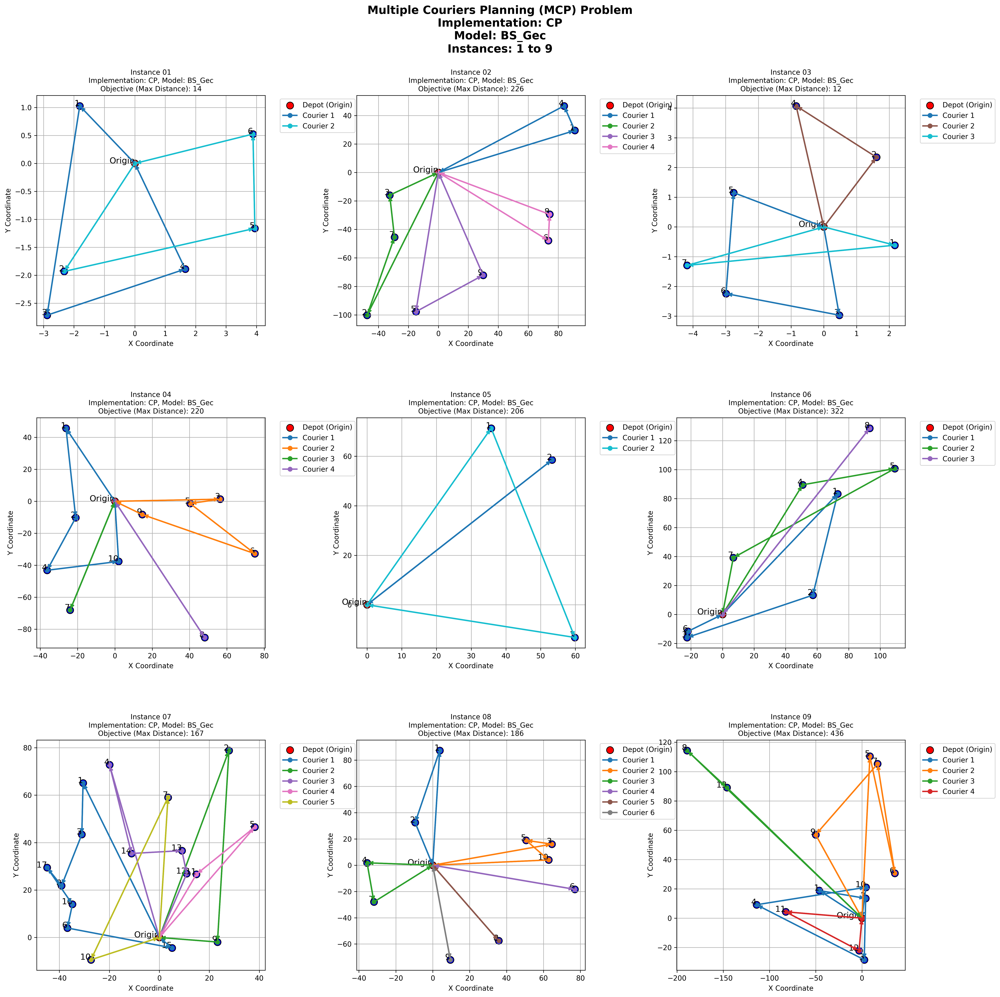
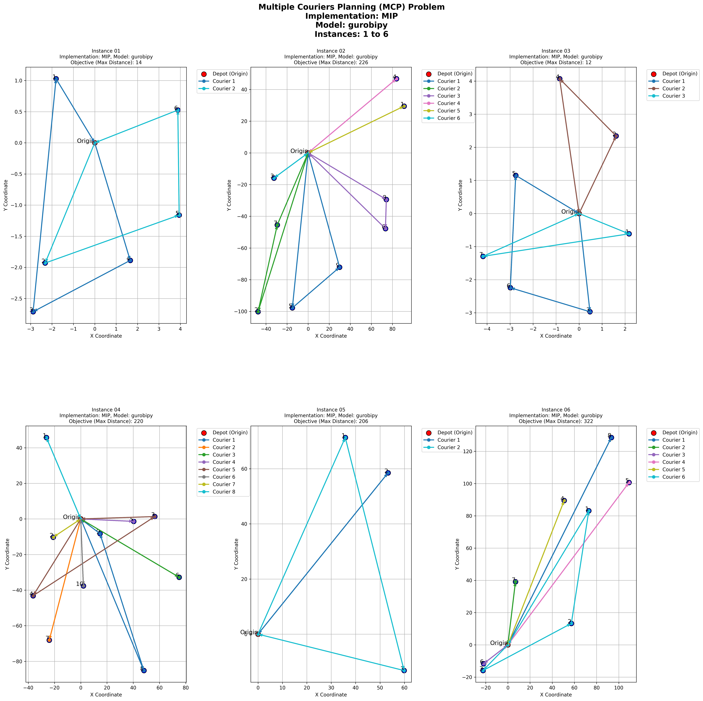

# Multiple Couriers Planning

This project implements different approaches to solve the Multiple Couriers Planning problem using various solving techniques:
- SMT (Satisfiability Modulo Theories)
- SAT (Boolean Satisfiability)
- CP (Constraint Programming)
- MIP (Mixed Integer Programming)


## Docker Setup

To build solver images for SAT, SMT and MIP:
```bash
docker-compose build
```

To build solver images for CP
```bash
docker build . -t image_cp -f Dockerfile_cp
```

## Running the Solvers

### CP (Constraint Programming)
```bash
docker run -v ./res:/app/res image_cp <model_name> <start_instance> <end_instance>
```

Available models:
- `bs_gecode`: base CP model using Gecode solver
- `bs_chuffed`: base CP model using Chuffed solver
- `bs_heu_gecode`: CP with heuristics using Gecode solver
- `bs_heu_chuffed`:  CP with heuristics using Chuffed solver
- `bs_heu_impl_gecode`: CP with heuristics and implied constraints using Gecode solver
- `bs_heu_impl_chuffed`: CP with heuristics and implied constraints using Chuffed solver
- `bs_heu_sym_gecode`: CP with heuristics and symmetry breaking constraints using Gecode solver
- `bs_heu_sym_chuffed`: CP with heuristics and symmetry breaking constraints using Chuffed solver
- `bs_heu_sym_impl_gecode`: CP with heuristics, implied constraints and symmetry breaking constraints using Gecode solver
- `bs_heu_sym_impl_chuffed`: CP with heuristics, implied constraints and symmetry breaking constraints using Chuffed solver

Example:
```bash
docker run -v ./res:/app/res image_cp bs_gecode 1 2
```

### SAT (Boolean Satisfiability)
```bash
docker run -v ./res:/app/res mcp-sat <model_name> <start_instance> <end_instance>
```

Available models:
- `LNS`: Linear Search
- `LNS_SYB`: Linear Search with symmetry breaking constraints
- `BNS`: Binary Search
- `BNS_SYB`: Binary Search with symmetry breaking constraints

Example:
```bash
docker run -v ./res:/app/res mcp-sat LNS 1 2
```

### SMT (Satisfiability Modulo Theories)
```bash
docker run -v ./res:/app/res mcp-smt --model <model_name> <start_instance> <end_instance>
```

Available models:
- `z3_smt_base`
- `z3_smt_symbrk`
- `z3_smt_symbrk_implconstr`
- `z3_smt_symbrk_binarysearch`

Example:
```bash
docker run -v ./res:/app/res mcp-smt --model z3_smt_base 1 3
```

### MIP (Mixed Integer Programming)

### Gurobi License
This project uses a Gurobi Web License Service (WLS) for the MIP implementation. WLS is a cloud-based licensing system that allows Gurobi to run in containers with internet connectivity. When the MIP solver starts, it uses the credentials in the `MIP/gurobi.lic` file to communicate with Gurobi's WLS server, which generates a cryptographic token (JWT) enabling the application to run on the container. These tokens are automatically renewed while the solver is running, requiring a stable internet connection.

The Academic WLS client license used in this project has the following specifications:
- Runs on both physical machines and containers
- Requires Gurobi version 10 or later
- Requires an active internet connection during usage
- Valid for 90 days
- Includes a light version of Compute Server with:
  - Disabled queueing functionality
  - Fixed job limit of 1


First, build the base image:
```bash
docker build -t mcp-base -f Dockerfile.base .
```

Then build the MIP solver:
```bash
docker-compose build mip
```

To run the solver:
```bash
docker run -v ./res:/app/res -v ./instances:/app/instances mcp-mip <start_instance> <end_instance>
```

For better container cleanup, use:
```bash
docker run --rm -v ./res:/app/res -v ./instances:/app/instances mcp-mip <start_instance> <end_instance> && docker container prune -f
```

Example:
```bash
docker run --rm -v ./res:/app/res -v ./instances:/app/instances mcp-mip 1 3 && docker container prune -f
```

## Results

Solutions are saved in the `res` directory, organized by solver type:
- `res/SMT/`: SMT solutions
- `res/SAT/`: SAT solutions
- `res/CP/`: CP solutions
- `res/MIP/`: MIP solutions

Each solution file is in JSON format and contains:
- Solving time
- Optimality status
- Objective value
- Solution (assignment of items to couriers)

### Solution Checker
To verify the correctness of the solutions, you can use the solution checker:
```bash
python3 solution_checker.py <instances_directory> <results_directory>
```

Example:
```bash
python3 solution_checker.py instances res/
```

## Graph Creation

The project includes a visualization tool that creates graphs showing the routes taken by each courier. This tool is containerized independently from the main solvers.

### Building and Running the Graph Creator

1. If needed, make the run script executable:

```bash
chmod +x run_graph_creator.sh
```


2. Use the script to create graphs:
```bash
./run_graph_creator.sh <implementation> <start_instance> <end_instance> <model>
```
Parameters:
- `implementation`: The solver implementation (cp/sat/smt/mip)
- `start_instance`: First instance to visualize (1-21)
- `end_instance`: Last instance to visualize (1-21)
- `model`: Model name as it appears in the solution files

Examples:
```bash
# Generate graphs for CP implementation with bs_gecode model, instances 1-10
./run_graph_creator.sh cp 1 9 BS_Gec
# Generate graphs for SAT implementation with LNS_SYB model, instances 1-5
./run_graph_creator.sh sat 1 9 LNS_SYB
# Generate graphs for SMT implementation with z3_smt_symbrk model, instances 1-5
./run_graph_creator.sh smt 1 9 z3_smt_symbrk
# Generate graphs for MIP implementation with gurobipy model, instances 1-3
./run_graph_creator.sh mip 1 9 gurobipy
```
The generated graphs will be saved in the `graphs/<IMPLEMENTATION>` directory, showing:
- Depot location (marked as Origin)
- Item locations (numbered points)
- Routes for each courier (colored arrows)
- Maximum distance achieved for each instance

The graph creator uses MDS (Multidimensional Scaling) to convert the distance matrix into 2D coordinates. MDS is a dimensionality reduction technique that tries to preserve the pairwise distances between points. It takes the distance matrix D as input (which may be non-symmetric) and outputs 2D coordinates that approximately maintain the original distances. Note that since we're projecting potentially asymmetric distances into a symmetric Euclidean space, the visualization is an approximation of the actual distances.



## Authors
- Leonardo Mannini
- Lorenzo Sansone
